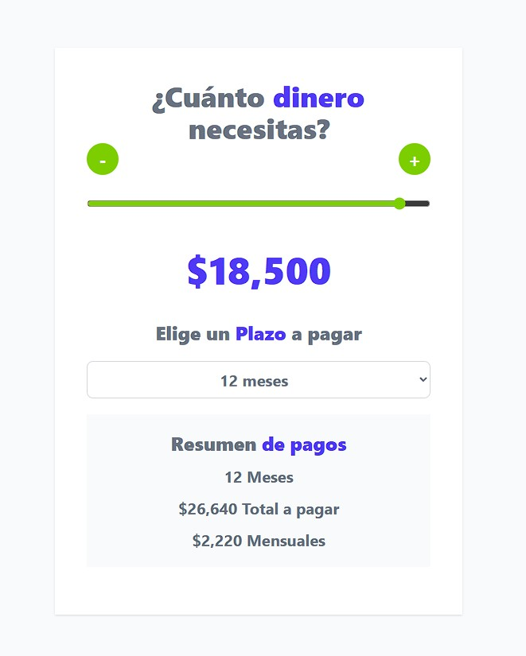

# Calculadora Prestamos React:

Calculadora de prestamos, para aplicar y aprender conceptos básicos de React.

Tiene las siguientes características:

- Input de tipo "range" para seleccionar la cantidad del prestamo.
- Bótones para umentar o disminuir la cantidad del prestamo.
- Cantidad del prestamo aumenta o disminuye de a 100.
- Moneda formateada en dolares.
- Calcula el total del prestamo con intereses.
- Calcula el valor a pagar mensual.
- Utiliza Tailwind para los estilos.
___

## Desarrollo

Para **desarrollo**: 

1) Instalar dependencias.
```
pnpm i
```
2) Correr servidor con:

```
pnpm run dev
```
___

Para **producción**: 

1) Repetir pasos 1 de desarrollo.

2) Correr servidor con:

```
pnpm run build
```
3) Subir archivos de la carpeta "dist" al servidor .
___

## Screenshots

